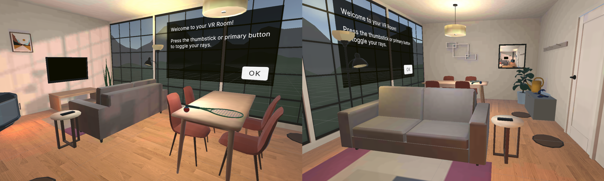

# Unity VR Room Experience

## Overview

 This project was developed as part of an official Unity course focused on implementing interactive and immersive VR applications. The course covered various aspects of VR development, including locomotion, interactivity, audio, haptic feedback, user interfaces, and optimization for accessibility and comfort that can be tested in a virtual room.

## Features

- VR-ready project setup with a custom room environment.
- Locomotion implementation for smooth movement within the scene.
- Grabbable objects that users can interact with, pick up, and throw around.
- Sockets that allow objects to snap into specific locations.
- Audio and haptic feedback for a more immersive experience.
- Multiple types of interactors to provide diverse interactions.
- User interfaces integrated into the virtual world.
- Improved comfort and accessibility considerations.
- Optimized baked lighting for enhanced performance.

## Getting Started

To try out the VR experience, you'll need the following:

1. **Hardware**: A VR headset compatible with Unity, such as Meta Quest 2.

2. **Software**:
   - Unity 2020.3.

3. **Setup**:
   - Clone this repository to your local machine.
   - Open the project in Unity.
   - Connect the VR headset to your machine.
   - Build and run the project.
